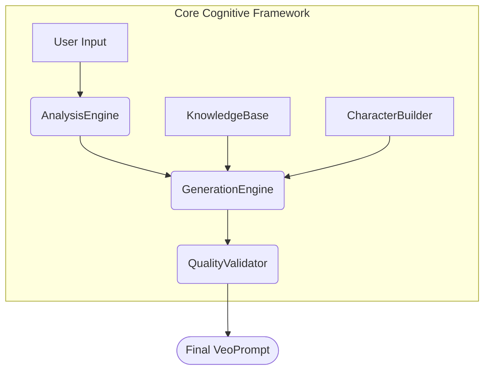

# Architecture Blueprint

This document outlines the complete architecture for the Veo-3 Meta-Framework application, as derived from the project's constitution in `GEMINI.md`.

## 1. Project Directory Structure

The project will follow a standard Python project layout with separate source and test directories.

```
veo3-meta-framework-impl/
├── src/
│   ├── __init__.py
│   ├── prompt_structure.py
│   ├── knowledge_base.py
│   ├── analysis_engine.py
│   ├── generation_engine.py
│   ├── quality_validator.py
│   ├── character_builder.py
│   └── main.py
├── tests/
│   ├── __init__.py
│   ├── test_prompt_structure.py
│   ├── test_knowledge_base.py
│   ├── test_analysis_engine.py
│   ├── test_generation_engine.py
│   ├── test_quality_validator.py
│   ├── test_character_builder.py
│   └── test_main.py
├── .gitignore
├── GEMINI.md
└── ARCHITECTURE.md
```

## 2. Python Source File Definitions

This section defines the public interface for each class and method in the `src` directory, including type hints and docstrings, which will be used to guide the implementation.

### `src/prompt_structure.py`

```python
from pydantic import BaseModel, Field
from typing import List

class VeoPrompt(BaseModel):
    """Defines the validated data structure for the final Veo 3 prompt output.

    This class uses pydantic for data validation to ensure that all generated
    prompts conform to the required 7-component format.
    """
    subject: str = Field(description="The primary subject of the scene.")
    action: str = Field(description="The action being performed by the subject.")
    scene: str = Field(description="The description of the scene and environment.")
    style: str = Field(description="The artistic or cinematic style of the video.")
    dialogue: str = Field(description="Any dialogue spoken in the scene.")
    sounds: str = Field(description="Description of background sounds or music.")
    technical: List[str] = Field(description="Technical specifications like resolution or aspect ratio.")
    negative_prompt: str = Field(description="Elements to exclude from the generation.", default="")
```

### `src/knowledge_base.py`

```python
from typing import List, Dict, Any

class KnowledgeBase:
    """Loads and provides access to Veo 3 technical specifications.

    This class is implemented as a singleton to ensure a single, consistent
    source of truth for technical data throughout the application.
    """
    _instance = None
    _specs: Dict[str, Any]

    def __new__(cls):
        if cls._instance is None:
            cls._instance = super(KnowledgeBase, cls).__new__(cls)
            # In a real implementation, this would load from a configuration file.
            cls._instance._specs = {
                "max_duration_seconds": 120,
                "resolutions": ["1080p", "4K", "8K"],
                "aspect_ratios": ["16:9", "1:1", "9:16", "4:3"],
                "max_dialogue_chars": 500
            }
        return cls._instance

    def get_max_duration(self) -> int:
        """Returns the maximum video duration in seconds.

        Returns:
            int: The maximum duration in seconds.
        """
        pass

    def get_supported_resolutions(self) -> List[str]:
        """Returns a list of supported video resolutions.

        Returns:
            List[str]: A list of supported resolutions.
        """
        pass
```

### `src/analysis_engine.py`

```python
from typing import Dict

class AnalysisEngine:
    """Parses the user's high-level text input to identify key entities.

    This engine is responsible for the initial interpretation of the user's
    creative intent.
    """

    def analyze_request(self, user_input: str) -> Dict[str, Any]:
        """Analyzes the raw user input string.

        This method will eventually use NLP techniques to extract structured data.
        For the initial implementation, it will perform a basic keyword analysis.

        Args:
            user_input (str): The raw user input string from the end-user.

        Returns:
            Dict[str, Any]: A structured dictionary representing the analyzed request.
        """
        pass
```

### `src/character_builder.py`

```python
from typing import Dict

class CharacterBuilder:
    """A specialized tool to create detailed character descriptions.

    This class uses a template to generate rich character details that can be
    used by the Generation Engine.
    """

    def create_character(self, high_level_description: Dict[str, Any]) -> str:
        """Creates a detailed, structured character string from a high-level description.

        Args:
            high_level_description (Dict[str, Any]): A dictionary containing key
                attributes of the character, such as name, age, or role.

        Returns:
            str: A detailed, structured character string for use in the prompt.
        """
        pass
```

### `src/generation_engine.py`

```python
from typing import Dict, Any
from .prompt_structure import VeoPrompt
from .knowledge_base import KnowledgeBase
from .character_builder import CharacterBuilder

class GenerationEngine:
    """Takes the analyzed request and constructs the full 7-component VeoPrompt."""

    def __init__(self, knowledge_base: KnowledgeBase, character_builder: CharacterBuilder):
        """Initializes the GenerationEngine with its necessary tools.

        Args:
            knowledge_base (KnowledgeBase): An instance of the KnowledgeBase to access
                technical constraints.
            character_builder (CharacterBuilder): An instance of the CharacterBuilder
                for creating detailed characters.
        """
        self._knowledge_base = knowledge_base
        self._character_builder = character_builder

    def generate_prompt(self, analyzed_request: Dict[str, Any]) -> VeoPrompt:
        """Constructs a VeoPrompt from an analyzed request.

        This method orchestrates the creative assembly of the prompt, using the
        analyzed request and specialized tools.

        Args:
            analyzed_request (Dict[str, Any]): The structured output from the
                AnalysisEngine.

        Returns:
            VeoPrompt: A populated, but not yet finalized, VeoPrompt object.
        """
        pass
```

### `src/quality_validator.py`

```python
from .prompt_structure import VeoPrompt

class QualityValidator:
    """Validates the generated VeoPrompt against rules and generates negative prompts."""

    def validate_and_finalize(self, prompt: VeoPrompt) -> VeoPrompt:
        """Validates and finalizes a VeoPrompt object.

        This method applies a set of quality rules to the generated prompt and
        appends a negative prompt to improve the final output quality.

        Args:
            prompt (VeoPrompt): The VeoPrompt object to validate.

        Returns:
            VeoPrompt: The validated and finalized VeoPrompt object.
        """
        pass
```

### `src/main.py`

```python
from .analysis_engine import AnalysisEngine
from .generation_engine import GenerationEngine
from .quality_validator import QualityValidator
from .knowledge_base import KnowledgeBase
from .character_builder import CharacterBuilder
from .prompt_structure import VeoPrompt

class CoreOrchestrator:
    """The central controller that manages the flow of data through all layers."""

    def __init__(self):
        """Initializes the CoreOrchestrator and all its component layers."""
        self.knowledge_base = KnowledgeBase()
        self.character_builder = CharacterBuilder()
        self.analysis_engine = AnalysisEngine()
        self.generation_engine = GenerationEngine(self.knowledge_base, self.character_builder)
        self.quality_validator = QualityValidator()

    def process_request(self, user_input: str) -> VeoPrompt:
        """Processes a user's request to generate a complete VeoPrompt.

        This is the main entry point for the application. It takes a raw user
        string and returns a final, validated VeoPrompt.

        Args:
            user_input (str): The user's high-level request string.

        Returns:
            VeoPrompt: The final, formatted VeoPrompt ready for use.
        """
        pass
```

## 3. Data Flow Diagram

This Mermaid diagram illustrates the sequential processing of a user's request through the Core Cognitive Framework.


